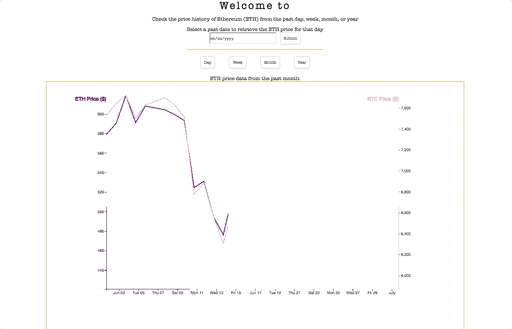
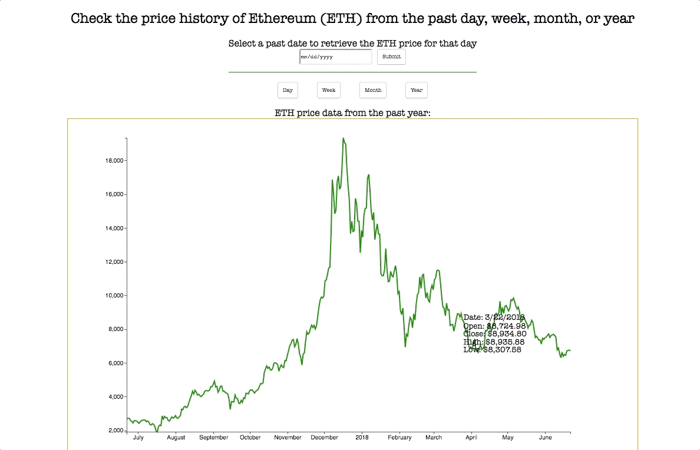

# Welcome to Crypto-Graph!
Live link: https://crypto-graph-kdzgkqyhkv.now.sh/

Crypto-Graph is a data visualization app that shows the price of Ethereum over time(the past day, week, month, or year)


### Technologies
- Technologies used include d3 and create-react-app with a node server and the app can run via docker container. It is deployed using now.sh (https://zeit.co/now) and the data is taken from the crypto-compare API (https://min-api.cryptocompare.com/)
- The app utilizes d3 to manipulate the DOM and React/Redux to fetch data and render svg elements

## Features
- Line chart to display ETH's price (open, close, high, and low) over time (day, week, month, or year)
- Form to input a past date and check ETH's price on that day
- Tracks mouse movements on hover of the line chart to display data


## Local Setup
- Clone this repo and navigate into the project directory
- Run ```npm install``` to install necessary node packages
- The ```npm start``` script will automatically open a tab in your browser to localhost:3000 which will display the app locally

## Passing data down components
- The DataVis component is responsible for making calls to fetch data and passing that data down as props to its child components (XAxis, YAxis, Line, and Mouse).
- On click of the different date-display buttons (i.e., day, week, month, year), the DataVis component sets the state of "data" to the information fetched according to that button. It then passes down the data to each child component via ```this.state.data``` allowing them to utilize it in different ways:

```
this.state = {
  data: this.props.ethMonth
};
```

```
componentDidMount() {
  this.props.fetchETHMonth().then(
    () => this.setState({data: this.props.ethMonth}));
}

handleClick(prop) {
  return (e) => (
    this.setState({data: prop})
  );
}
```
- The default data set is over a month's time.

```
<svg
  className="svg"
  viewBox={`200 0 ${height} 900`}
  width={width}
  height={height}
  style={{padding: "40px"}}
  tranform={`translate(${margin.left}, ${margin.top})`}>
  <AxisX
    data={this.state.data}
    height={height}
    width={width}/>
  <AxisY
    data={this.state.data}
    height={height}
    margin={margin}
    width={width}/>
  <Line
    data={this.state.data}
    height={height}
    margin={margin}
    width={width}/>
  <Mouse
    data={this.state.data}
    height={height}
    width={width}/>
</svg>
```
